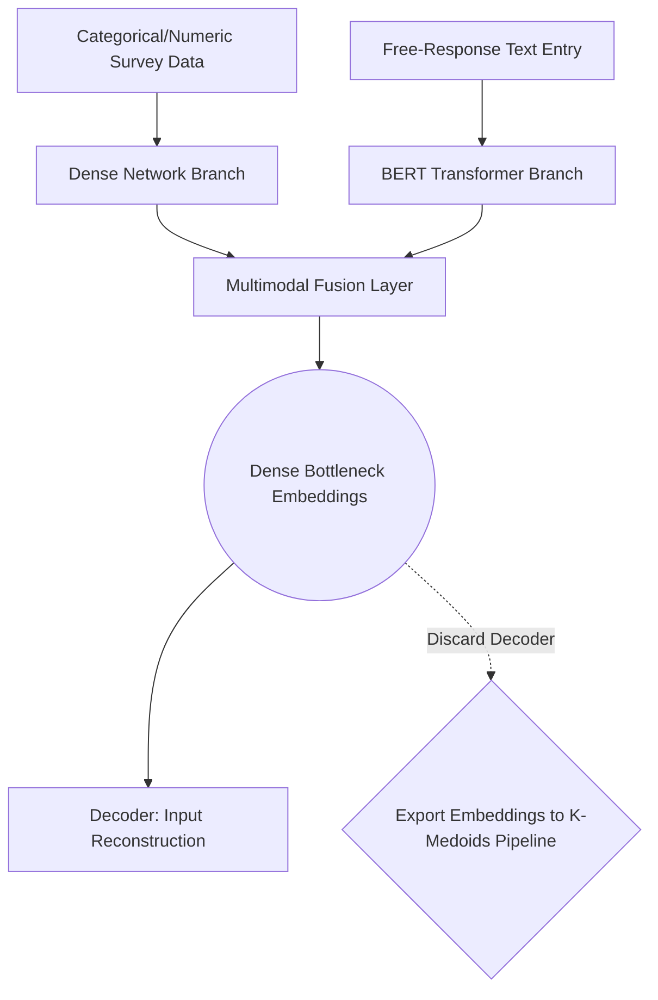

# Product Vision: Multimodal GroupGen Dashboard

## 1. Executive Summary

### Purpose
GroupGen is upgrading from a purely tabular logic engine to a **Multimodal Deep Learning System**. By adding a free-response text feature to the student intake survey (e.g., *"Describe your working style and project goals"*), the system will utilize a neural network to fuse unstructured natural language with structured tabular data before calculating the final classroom clusters.

### Motivation
Currently, GroupGen relies entirely on rigid, 1-4 scale survey answers to calculate student compatibility. A numerical scale leaves massive amounts of nuance on the table. Allowing students to write a few sentences about how they operate provides profound insight into their classroom compatibility. Traditional clustering algorithms (like K-Medoids) cannot process raw text. By building a multimodal architecture, we extract semantic meaning from unstructured text and mathematically bind it to the tabular traits, granting the algorithm a holistic picture of the student.

### Impact
This architecture bridges a critical gap in educational technology: capturing student nuance without forcing educators to manually read 100+ responses to assign groups. The AI handles the heavy lifting by matching complex personality embeddings natively, resulting in organically cohesive groups that still algorithmically obey strict constraints for group size, gender, and diversity.

---

## 2. Dataset Strategy

To ensure stable neural network training without overfitting, the system requires a high volume of structured and unstructured data.
- **Synthetic Data Generation**: We will utilize an LLM to procedurally generate a dataset of roughly **5,000 synthetic student profiles**. 
- **Structure**: The dataset will contain the standard GroupGen features (`Gender`, `Diversity`, `Learning Style`, `Motivation`, `Self-Esteem`, `Work Ethic`) alongside a new `Text` column containing a short paragraph describing the student's working style and goals.
- **Validation**: This volume guarantees the model processes enough textual variance and tabular combinations to properly learn the fusion manifold.

---

## 3. Multimodal Architecture (Methodology)

To fuse the data, GroupGen will deploy a **Two-Branch Multimodal Autoencoder**.

### Input Branches
1. **Branch 1 (Tabular)**: Categorical and numeric data passes through the existing GroupGen ingestion pipeline (`StandardScaler` for numeric traits, `OneHotEncoder` for categorical traits). It is then fed into standard Dense feed-forward layers.
2. **Branch 2 (Text)**: The free-response text is tokenized and processed through a pre-trained HuggingFace Transformer (e.g., **BERT**) to output a dense semantic embedding. *(Uses an 80/20 train/validation split)*.

### Fusion & Target Variables
The neural network functions via **unsupervised autoencoding**:
- **Fusion Layer**: The outputs of Branch 1 and Branch 2 are concatenated and passed through a series of joint Dense layers, forcing the network to learn the relationships between a student’s survey scale and actual written word.
- **Bottleneck**: The target variable is the input itself. The network compresses the fused data into a low-dimensional bottleneck layer and attempts to reconstruct the original inputs via a decoder.

---

## 4. Pipeline Integration

Once the Autoencoder is fully trained:
1. The **Decoder is discarded**. 
2. Real classroom data is passed through the Encoder to extract the fixed **"Student Embeddings"** from the bottleneck layer.
3. These rich embeddings are handed off to the existing **K-Medoids algorithm (Manhattan Distance)** to form the initial similarity clusters.
4. Finally, GroupGen's standard heuristic locking mechanism execution kicks in to seamlessly resolve hard constraints (size limits, gender rules, diversity protections).

---

## 5. Metrics and Evaluation

To prove algorithmic superiority and structural integrity, the Multimodal system will be benchmarked against the baseline Tabular GroupGen system.

### Autoencoder Performance
- **Loss Curves**: We will plot the Mean Squared Error (MSE) / Cross-Entropy loss for training and validation sets to mathematically prove the network successfully learned to compress and fuse the modalities.

### Clustering Efficacy
Using a separate set of test data, we will generate side-by-side comparison tables evaluating:
- **Calinski-Harabasz (CH) Index**: Ensuring spatial cluster dispersion remains strong.
- **Gender/Diversity Entropy**: Verifying that the NLP integration does not skew the constraint-lock fairness metrics.

### Visualizations
We will plot the embedding spaces using **PCA or t-SNE**. This will map precisely how the injection of semantic NLP text features visibly shifts and improves the student clusters compared to the rigid tabular baseline.
